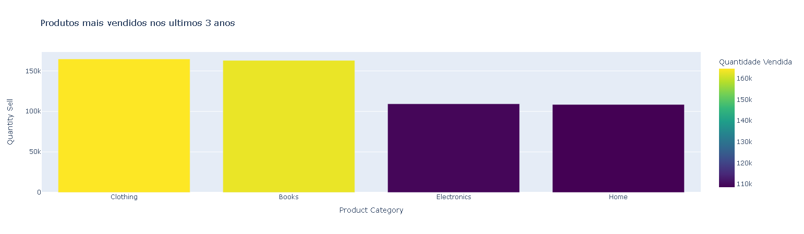
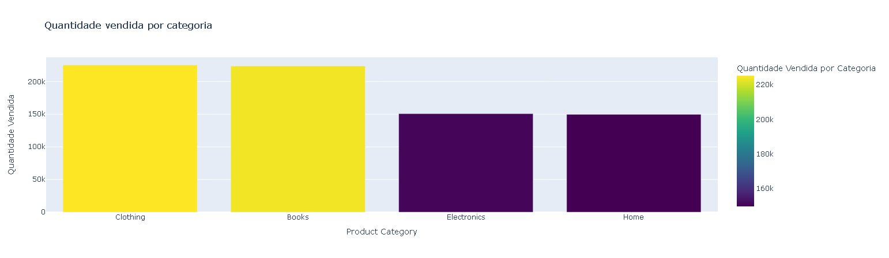
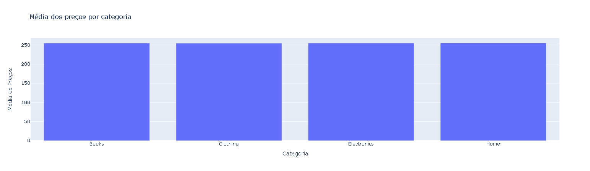
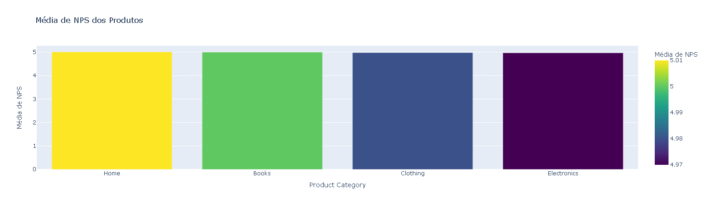
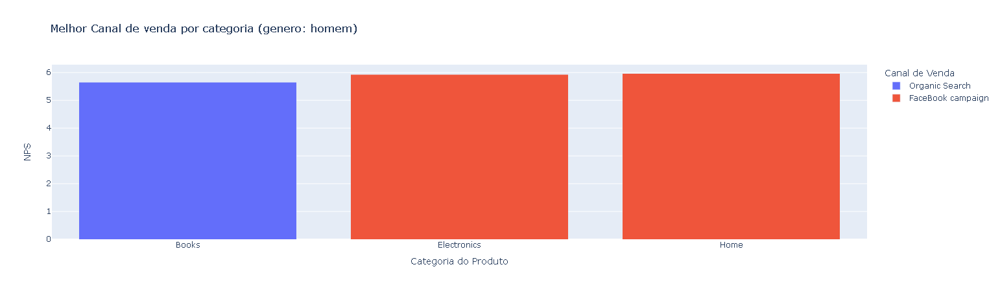
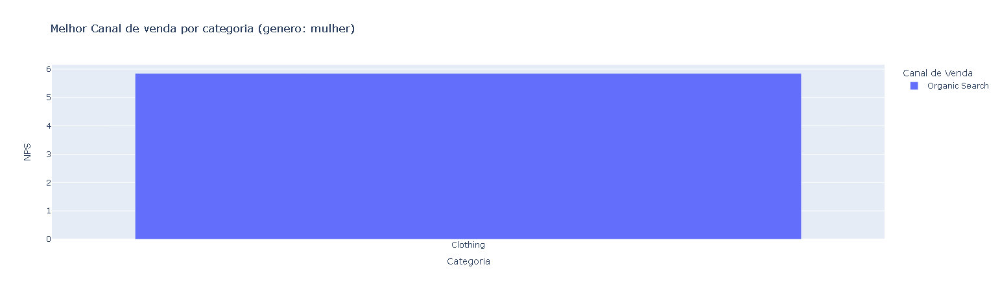

# informações retiradas da análise  
## Quais produtos mais vendidos considerando os últimos 3 anos?  
- Clothing: 164688 unidades vendidas  
- Books: 163000 unidades vendidas  
- Eletronics: 109328 unidades vendidas  
- Home: 108509 unidades vendidas  

## Qual o produto mais caro e o mais barato?  
- O produto mais caro custa: 500  
- O produto mais barato custa: 10  

## Qual a categoria de produto mais vendida e menos vendida?
- clothing: 225322 unidades vendidas
- Books: 223876 unidades vendidas
- Eletronics: 150828 unidades vendidas
- Home: 149698 unidades vendidas

- categoria mais vendida: Clothing
- categoria menos vendida: Home

## Qual a categoria mais cara e a mais barata?  
- Média dos preços por categoria:  
- Home: 254,84  
- Eletronics: 254,72  
- Books: 254,71  
- Clothing: 254,45  

- categoria mais cara: Home  
- categoria mais barata: Clothing  

# Qual o protudo com o melhor e o pior NPS?
- Nesta análise, primeiramente foi identificada a média de NPS para cada categoria.   

- Resultado:  
- Home: 5.01   
- Books: 5  
- Clothing: 4.98  
- Eletronics: 4.97    

- melhor NPS: Home  
- pior NPS: Eletronics

## Analisando a base de dados, qual o tipo de público (considerando gênero e idade) e o canal ideal para vender determinado tipo de produto?  

- melhor canal de vendas:  
	- Clothing: Organic Search  
	- Books: Organic Search  
	- Eletronics: Facebook Campaign  
	- Home: Facebook Campaign   
 
- melhor categoria por gênero:  
	- Clothing: Female  
	- Books: Male  
	- Eletronics: Male  
	- Home: Male

